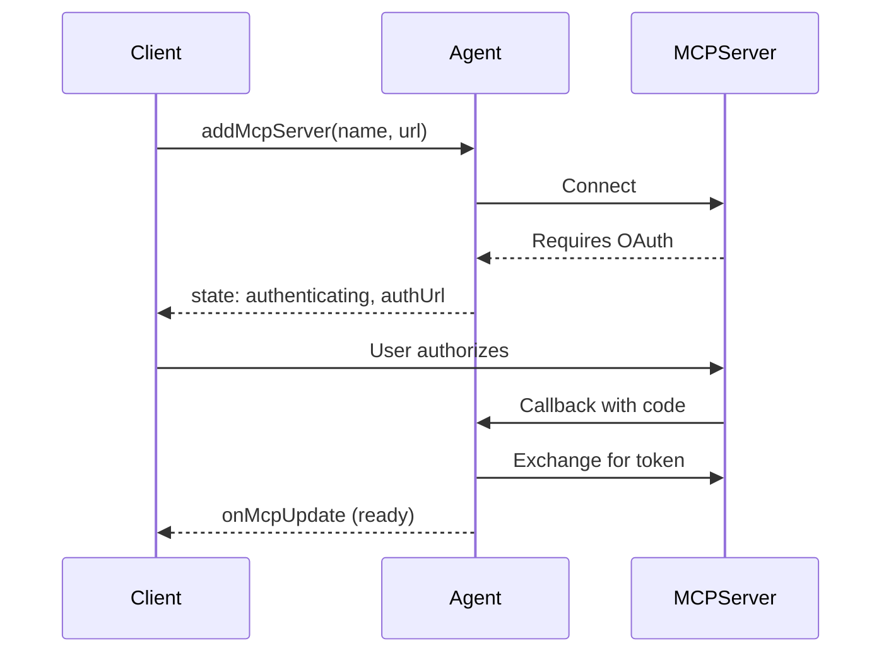

import { TypeScriptExample } from "~/components";

Connect your agent to external MCP (Model Context Protocol) servers to use their tools, resources, and prompts. This enables your agent to interact with GitHub, Slack, databases, and other services through a standardized protocol.

## Overview

The MCP client capability lets your agent:

- **Connect to external MCP servers** - GitHub, Slack, databases, AI services
- **Use their tools** - Call functions exposed by MCP servers
- **Access resources** - Read data from MCP servers
- **Use prompts** - Leverage pre-built prompt templates

:::note
This page covers connecting to MCP servers as a client. To create your own MCP server, refer to [Creating MCP Servers](/agents/model-context-protocol/mcp-server-creation/).
:::

## Quick Start

<TypeScriptExample>
```typescript
import { Agent } from "agents";

export class MyAgent extends Agent {
  async onRequest(request: Request) {
    // Add an MCP server
    const result = await this.addMcpServer(
      "github",
      "https://mcp.github.com/sse"
    );

    if (result.state === "authenticating") {
      // Server requires OAuth - redirect user to authorize
      return Response.redirect(result.authUrl);
    }

    // Server is ready - tools are now available
    const state = this.getMcpServers();
    console.log(`Connected! ${state.tools.length} tools available`);

    return new Response("MCP server connected");
  }
}
```
</TypeScriptExample>

## Adding MCP Servers

Use `addMcpServer()` to connect to an MCP server with an options-based API:

<TypeScriptExample>
```typescript
const result = await this.addMcpServer(name, url, options?);
```
</TypeScriptExample>

### Basic Usage

<TypeScriptExample>
```typescript
// Simple connection
await this.addMcpServer("notion", "https://mcp.notion.so/sse");

// With explicit callback host
await this.addMcpServer("github", "https://mcp.github.com/sse", {
  callbackHost: "https://my-worker.workers.dev"
});
```
</TypeScriptExample>

### Transport Options

MCP supports multiple transport types:

<TypeScriptExample>
```typescript
await this.addMcpServer("server", "https://mcp.example.com", {
  transport: {
    // Transport type: "sse", "streamable-http", or "auto" (default)
    type: "sse"
  }
});
```
</TypeScriptExample>

| Transport           | Description                                    |
| ------------------- | ---------------------------------------------- |
| `"auto"`            | Auto-detect based on server response (default) |
| `"sse"`             | Server-Sent Events - widely supported          |
| `"streamable-http"` | HTTP with streaming - newer protocol           |

### Custom Headers

For servers behind authentication (like Cloudflare Access) or using bearer tokens:

<TypeScriptExample>
```typescript
await this.addMcpServer("internal", "https://internal-mcp.example.com", {
  transport: {
    headers: {
      Authorization: "Bearer my-token",
      "CF-Access-Client-Id": "...",
      "CF-Access-Client-Secret": "..."
    }
  }
});
```
</TypeScriptExample>

### Return Value

`addMcpServer()` returns the connection state:

<TypeScriptExample>
```typescript
type AddMcpServerResult =
  | { id: string; state: "ready" }
  | { id: string; state: "authenticating"; authUrl: string };
```
</TypeScriptExample>

- **`ready`** - Server connected and tools discovered
- **`authenticating`** - Server requires OAuth; redirect user to `authUrl`

## OAuth Authentication

Many MCP servers require OAuth authentication. The agent handles the OAuth flow automatically with built-in callback handling.

### How It Works



### Handling OAuth in Your Agent

<TypeScriptExample>
```typescript
async onRequest(request: Request) {
  const result = await this.addMcpServer("github", "https://mcp.github.com/sse");

  if (result.state === "authenticating") {
    // Option 1: Redirect the user
    return Response.redirect(result.authUrl);

    // Option 2: Return the URL for client-side redirect
    return Response.json({
      status: "needs_auth",
      authUrl: result.authUrl
    });
  }

  return Response.json({ status: "connected", id: result.id });
}
```
</TypeScriptExample>

### OAuth Callback

The callback URL is automatically constructed:

```
https://{host}/{agentsPrefix}/{agent-name}/{instance-name}/callback
```

For example: `https://my-worker.workers.dev/agents/my-agent/default/callback`

OAuth tokens are securely stored in SQLite and persist across agent restarts.

### Custom Callback Handling

For custom OAuth completion behavior:

<TypeScriptExample>
```typescript
// In your agent constructor or onStart
this.mcp.configureOAuthCallback({
  // Redirect after successful auth
  successRedirect: "https://myapp.com/success",

  // Redirect on error
  errorRedirect: "https://myapp.com/error",

  // Or use a custom handler
  customHandler: (result) => {
    return new Response(
      JSON.stringify({
        success: result.authSuccess,
        serverId: result.serverId,
        error: result.authError
      }),
      {
        headers: { "Content-Type": "application/json" }
      }
    );
  }
});
```
</TypeScriptExample>

## Using MCP Capabilities

Once connected, access the server's capabilities:

### Getting Available Tools

<TypeScriptExample>
```typescript
const state = this.getMcpServers();

// All tools from all connected servers
for (const tool of state.tools) {
  console.log(`Tool: ${tool.name}`);
  console.log(`  From server: ${tool.serverId}`);
  console.log(`  Description: ${tool.description}`);
}
```
</TypeScriptExample>

### Resources and Prompts

<TypeScriptExample>
```typescript
const state = this.getMcpServers();

// Available resources
for (const resource of state.resources) {
  console.log(`Resource: ${resource.name} (${resource.uri})`);
}

// Available prompts
for (const prompt of state.prompts) {
  console.log(`Prompt: ${prompt.name}`);
}
```
</TypeScriptExample>

### Server Status

<TypeScriptExample>
```typescript
const state = this.getMcpServers();

for (const [id, server] of Object.entries(state.servers)) {
  console.log(`${server.name}: ${server.connectionState}`);
  // connectionState: "ready" | "authenticating" | "connecting" | "not-connected"
}
```
</TypeScriptExample>

### Integration with AI SDK

To use MCP tools with the Vercel AI SDK, use `this.mcp.getAITools()` which converts MCP tools to AI SDK format:

<TypeScriptExample>
```typescript
import { generateText } from "ai";

async function chat(prompt: string) {
  const response = await generateText({
    model: openai("gpt-4"),
    prompt,
    tools: this.mcp.getAITools() // Converts MCP tools to AI SDK format
  });

  return response;
}
```
</TypeScriptExample>

:::note
`getMcpServers().tools` returns raw MCP `Tool` objects for inspection. Use `this.mcp.getAITools()` when passing tools to the AI SDK.
:::

## Managing Servers

### Removing a Server

<TypeScriptExample>
```typescript
await this.removeMcpServer(serverId);
```
</TypeScriptExample>

This disconnects from the server and removes it from storage.

### Persistence

MCP servers persist across agent restarts:

- Server configuration stored in SQLite
- OAuth tokens stored securely
- Connections restored automatically when agent wakes

### Listing All Servers

<TypeScriptExample>
```typescript
const state = this.getMcpServers();

for (const [id, server] of Object.entries(state.servers)) {
  console.log(`${id}: ${server.name} (${server.server_url})`);
}
```
</TypeScriptExample>

## Client-Side Integration

Connected clients receive real-time MCP updates via WebSocket:

<TypeScriptExample>
```typescript
import { useAgent } from "agents/react";

function Dashboard() {
  const [tools, setTools] = useState([]);
  const [servers, setServers] = useState({});

  const agent = useAgent({
    agent: "MyAgent",
    onMcpUpdate: (mcpState) => {
      setTools(mcpState.tools);
      setServers(mcpState.servers);
    }
  });

  return (
    <div>
      <h2>Connected Servers</h2>
      {Object.entries(servers).map(([id, server]) => (
        <div key={id}>
          {server.name}: {server.connectionState}
        </div>
      ))}

      <h2>Available Tools ({tools.length})</h2>
      {tools.map(tool => (
        <div key={`${tool.serverId}-${tool.name}`}>
          {tool.name}
        </div>
      ))}
    </div>
  );
}
```
</TypeScriptExample>

## Advanced: MCPClientManager

For fine-grained control, use `this.mcp` directly:

### Step-by-Step Connection

<TypeScriptExample>
```typescript
// 1. Register the server
await this.mcp.registerServer(id, {
  url: "https://mcp.example.com",
  name: "My Server",
  callbackUrl: "https://my-worker.workers.dev/agents/my-agent/default/callback",
  transport: { type: "auto" }
});

// 2. Connect
const connectResult = await this.mcp.connectToServer(id);

if (connectResult.state === "failed") {
  console.error("Connection failed:", connectResult.error);
  return;
}

if (connectResult.state === "authenticating") {
  // Handle OAuth...
  return;
}

// 3. Discover capabilities
const discoverResult = await this.mcp.discoverIfConnected(id);

if (!discoverResult?.success) {
  console.error("Discovery failed:", discoverResult?.error);
}
```
</TypeScriptExample>

### Event Subscription

<TypeScriptExample>
```typescript
// Listen for state changes
this.mcp.onServerStateChanged(() => {
  console.log("MCP server state changed");
  this.broadcastMcpServers(); // Notify connected clients
});
```
</TypeScriptExample>

### Error Recovery

<TypeScriptExample>
```typescript
async retryConnection(serverId: string) {
  // Retry connection for a registered server
  const result = await this.mcp.connectToServer(serverId);

  if (result.state === "connected") {
    await this.mcp.discoverIfConnected(serverId);
  }
}
```
</TypeScriptExample>

## Examples

### MCP Client Demo

The [MCP Client example](https://github.com/cloudflare/agents/tree/main/examples/mcp-client) demonstrates:

- Adding and removing MCP servers dynamically
- Custom OAuth callback handling (popup-closing behavior)
- Listing tools from connected servers
- Real-time state updates to the frontend

<TypeScriptExample>
```typescript
// From examples/mcp-client/src/server.ts
export class MyAgent extends Agent {
  onStart() {
    // Custom OAuth callback that closes the popup window
    this.mcp.configureOAuthCallback({
      customHandler: (result) => {
        if (result.authSuccess) {
          return new Response("<script>window.close();</script>", {
            headers: { "content-type": "text/html" }
          });
        }
        // Handle error...
      }
    });
  }

  async onRequest(request: Request) {
    const url = new URL(request.url);

    if (url.pathname.endsWith("add-mcp")) {
      const { name, url } = await request.json();
      await this.addMcpServer(name, url);
      return new Response("Ok");
    }
    // ...
  }
}
```
</TypeScriptExample>

## API Reference

### addMcpServer()

<TypeScriptExample>
```typescript
// Preferred signature
async addMcpServer(
  name: string,
  url: string,
  options?: {
    callbackHost?: string;
    agentsPrefix?: string;
    client?: ClientOptions;
    transport?: {
      headers?: HeadersInit;
      type?: "sse" | "streamable-http" | "auto";
    };
  }
): Promise<
  | { id: string; state: "ready" }
  | { id: string; state: "authenticating"; authUrl: string }
>

// Legacy signature (still supported)
async addMcpServer(
  name: string,
  url: string,
  callbackHost?: string,
  agentsPrefix?: string,
  options?: { ... }
): Promise<...>
```
</TypeScriptExample>

Add and connect to an MCP server. Throws if connection or discovery fails.

### removeMcpServer()

<TypeScriptExample>
```typescript
async removeMcpServer(id: string): Promise<void>
```
</TypeScriptExample>

Disconnect from and remove an MCP server.

### getMcpServers()

<TypeScriptExample>
```typescript
getMcpServers(): MCPServersState
```
</TypeScriptExample>

Get the current state of all MCP servers and their capabilities.

### MCPServersState

<TypeScriptExample>
```typescript
type MCPServersState = {
  servers: {
    [id: string]: MCPServer;
  };
  tools: (Tool & { serverId: string })[];
  prompts: (Prompt & { serverId: string })[];
  resources: (Resource & { serverId: string })[];
};
```
</TypeScriptExample>

### MCPServer

<TypeScriptExample>
```typescript
type MCPServer = {
  name: string;
  server_url: string;
  auth_url: string | null;
  connectionState: "ready" | "authenticating" | "connecting" | "not-connected";
  tools?: Tool[];
  resources?: Resource[];
  prompts?: Prompt[];
};
```
</TypeScriptExample>
